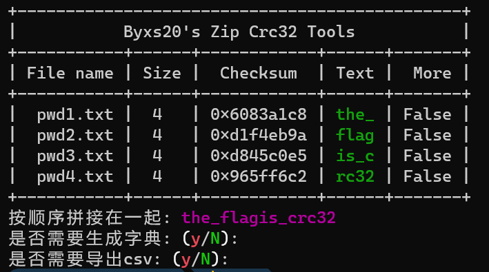
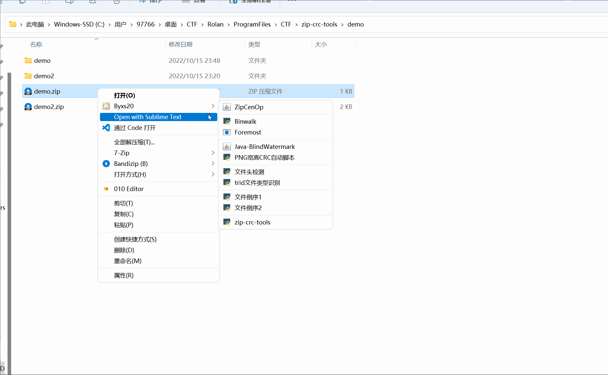

# Zip-Crc-Tools

#### 0.关于

&nbsp;&nbsp;&nbsp;&nbsp;本项目是基于 [theonlypwner/crc32](https://github.com/theonlypwner/crc32) 实现的，如果有Bug，可以联系我或者提交Issues。

 

#### 1.环境：

&nbsp;&nbsp;&nbsp;&nbsp;系统：`Windows`

&nbsp;&nbsp;&nbsp;&nbsp;Python版本：`Python3`

 

#### 2.食用过程：

1. `git clone https://github.com/theonlypwner/crc32` （务必，没有安装git的话看注意事项3）

2. `pip3 install requirements.txt`

3. `python3 .\main.py -f .\demo\demo.zip`

 

#### 3.注意事项：

1. 您必须本项目的目录要有crc32的目录，里面是 [theonlypwner/crc32](https://github.com/theonlypwner/crc32) 的所有代码！
2. 生成的字典和生成的CSV都会出现在PK-zip的同级目录下，分别叫`output.dic` 和 `output.csv` ！
3. 手动去 https://github.com/theonlypwner/crc32 下载然后放到本项目目录，并重命名目录名为 `crc32` ！

 

#### 4.运行效果：

 

下面演示是通过 [BluePointLilac/ContextMenuManager](https://github.com/BluePointLilac/ContextMenuManager) 实现的绑定到右键的效果：

